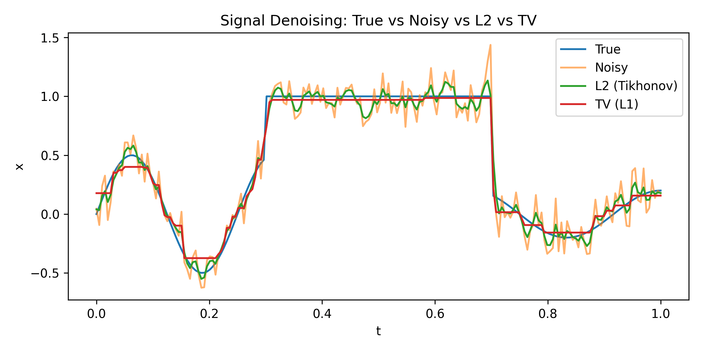
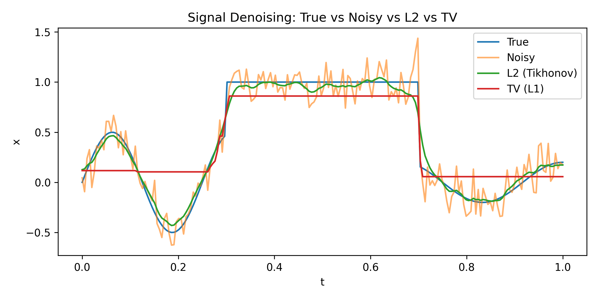
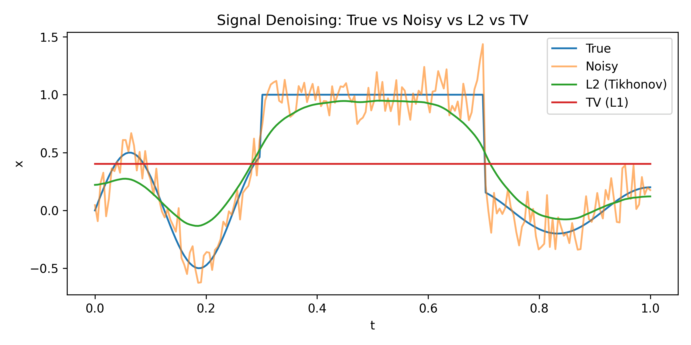

# 🧠 Signal Denoising via Optimization

Implementation of **L2 (Tikhonov)** and **L1 (Total Variation)** regularization methods for 1D signal denoising, as part of the *Signal Processing* course (University of Patras, 2025).

---

## 📘 Overview

This project demonstrates how different regularization strategies affect the denoising of a 1D piecewise signal contaminated by Gaussian noise.  
The **L2 (Tikhonov)** method produces globally smooth reconstructions, while the **L1 (Total Variation)** method preserves sharp edges and discontinuities.

---

## 📂 Repository Structure

```
Signal-Denoising/
├── src/
│   └── denoising.py             # Python implementation
│
├── plots/
│   ├── denoising_lambda_0.1.png
│   ├── denoising_lambda_1.png
│   ├── denoising_lambda_10.png
│   └── denoising_lambda_100.png
│
├── report/
│   ├── main.tex                 # LaTeX source file
│   └── Signal_Denoising.pdf     # Final compiled report
│
├── requirements.txt             # Python dependencies
└── README.md                    # Project documentation
```

---

## ⚙️ Installation & Usage

### 1. Clone the repository
```bash
git clone https://github.com/<your-username>/Signal-Denoising.git
cd Signal-Denoising
```

### 2. Install dependencies
```bash
pip install -r requirements.txt
```

### 3. Run the script
```bash
python src/denoising.py
```

This will:
- Generate the noisy signal and its reconstructions using both L2 and L1 regularization  
- Print Mean Squared Errors (MSE) for both methods  
- Save comparison plots in the `/plots` folder

---

## 🖼️ Example Results

Plots below show reconstructions for different regularization strengths  
(\(λ = 0.1, 1, 10, 100\)):

| λ = 0.1 | λ = 1 | λ = 10 | λ = 100 |
|:--:|:--:|:--:|:--:|
|  |  |  |  |

As λ increases, the signal becomes progressively smoother, with TV regularization maintaining edges more effectively than L2.

---

## 🧠 Key Observations

- **Small λ:** faithful to the data, but noisy  
- **Large λ:** smoother, but may oversmooth  
- **TV (L1):** better for signals with edges or discontinuities  
- **L2:** behaves like a linear low-pass filter

---

## 🧰 Dependencies

- `numpy`  
- `scipy`  
- `matplotlib`  
- `cvxpy`  
- `osqp`  

All included in `requirements.txt`.

---

## 📜 License

This project is licensed under the **MIT License** — feel free to use, modify, and share it with proper credit.

---

## 👤 Author

**Konstantinos Tsironis**  
University of Patras — Department of Electrical & Computer Engineering  
*October 2025*
